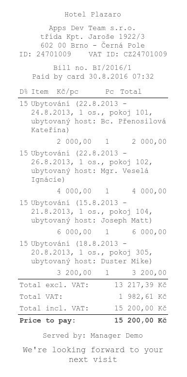

ReceiptPrint
===

A component for printing receipts. Example of receipt:



Installation
---

1. composer

```bash
composer require adt/receipt-print
```

2. config.neon

```neon
service:
    - ADT\ReceiptPrint\Service
```

Usage
---

In presenter:

```php

/** @var \ADT\ReceiptPrint\Service @autowire */
public $receiptPrintService;

public function actionPrint($receiptId) {
    $receiptEntity = $this->db->receipts->getOne($receiptId);
    
    $receipt = $this->receiptPrintService->createNewReceipt();
    
    $receipt
        ->setWidth(80)                         // Width of the receipt in [mm]
        ->setThankYouText("We're looking forward to your next visit")   // optional
        
        ->setFacilityName('Hotel Plazaro')     // optional
        
        ->setCompanyName('Apps Dev Team s.r.o.')
        ->setCompanyStreet('třída Kpt. Jaroše 1922/3')
        ->setCompanyZip('602 00')
        ->setCompanyCity('Brno - Černá Pole')
        ->setCompanyIno('24701009')
        ->setCompanyVatin('CZ24701009')        // optional
        
        ->setNumber('BI/2016/1')
        ->setPaymentTypeText('Paid by card')   // optional
        ->setIssueDate(new \DateTime('2016-08-29 14:48'))   // optional
        ->setCurrencyCode('Kč')
        
        ->addItem(
            'Accommodation',                   // Description
            15,                                // Vat Rate
            12,                                // Price per peace
            2,                                 // Number of peaces - optional (default = 1)
            24                                 // Total - optional (default = <price_per_pc>*<pc>)
        )
        ->addItem('Accommodation', 15, 12)
        
        ->setTotalExcludeVat(31.30)            // optional
        ->setTotalVat(4.70)                    // optional
        ->setTotal(36)                         // optional
        
        ->setEmployeeName('John Doe');         // optional
    
    $this->receiptPrintService->print($receipt);
}
```

You can set up the basics for all receipts in config. First create a config class:
```php
class ReceiptPrintConfig extends \ADT\ReceiptPrint\Config {

    /** @var \My\DB\Model */
    protected $db;

    public function __construct(\My\DB\Model $db) {
        $this->db = $db;
        
        $this
            ->setWidth(80)
            ->setThankYouText("We're looking forward to your next visit")
            
            ->setFacilityName('Hotel Plazaro')
            
            ->setCompanyName('Apps Dev Team s.r.o.')
            ->setCompanyStreet('třída Kpt. Jaroše 1922/3')
            ->setCompanyZip('602 00')
            ->setCompanyCity('Brno - Černá Pole')
            ->setCompanyIno('24701009')
            ->setCompanyVatin('CZ24701009')
            
            ->setCurrencyCode('Kč')
            ->setEmployeeName('John Doe');
    }

}
```

Then register the config class in neon:

1.

```neon
service:
    receiptPrintConfig: ReceiptPrintConfig
    - ADT\ReceiptPrint\Service(@receiptPrintConfig)
```

2.

```
receiptPrint:
    config: ReceiptPrintConfig
```

3.

Will be implemented in future:

```
receiptPrint:
    config:
        width: 80
        ...
```


